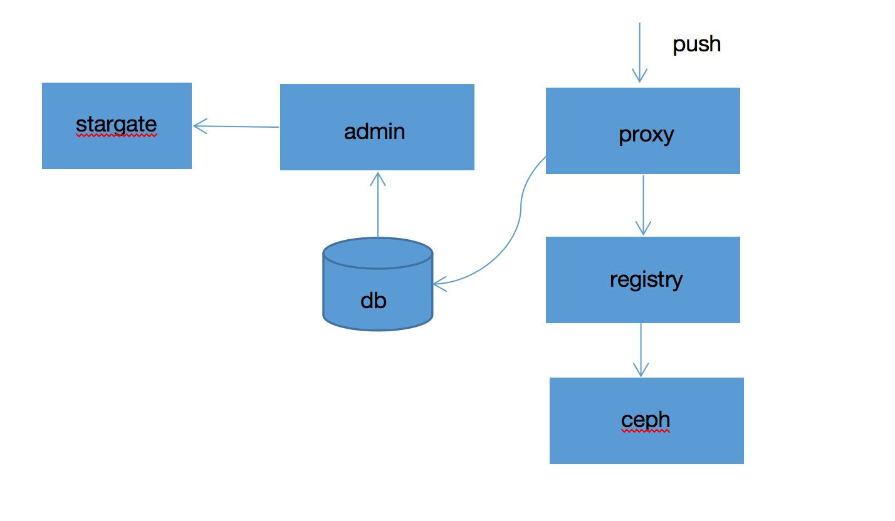

#Dockeryard
## 一：简介
dockeryard是容器云平台的镜像管理系统，实现了镜像的审计，清理等功能。
架构图：


## 二：部署
### 1 core
该目录为一些基础的依赖，需要提前在本地安装
进入该目录，执行命令
```xml
mvn install
```
### 2 front
dockeryard的前端项目，前端采用的vue实现的，需要本地安装npm，想关安装请参考官方文档
```xml
npm install
npm run dev
```
注意：为了更好的完成前后端部署，可以将前端文件打包到admin的resources下的static目录，可以在front目录直接执行命令
```xml
npm run build
```
该命令可以执行将前端部署文件打包进admin的文件夹
### 3 admin
该项目为镜像管理系统，提供了镜像的查看，清理等功能

编译和运行依赖的组件：JDK 8 + Maven 3.3.9 + MySQL5.7

分别把目录sql中的ppdai_dockeryard.sql导入到MySQL中
修改src/main/resources/application.properties中的数据库配置（spring.datasource.url, spring.datasource.username, spring.datasource.password）为正确值
执行如下命令打包
```xml
mvn clean package -DskipTests=true
```
运行命令启动服务
```xml
java -jar admin-0.0.1-SNAPSHOT.jar
```

### 4 proxy
该项目，需要和docker registry一起使用，拦截push 和pull相关的请求，并对请求进行请求审计，对用户进行权限校验，镜像审计等功能


